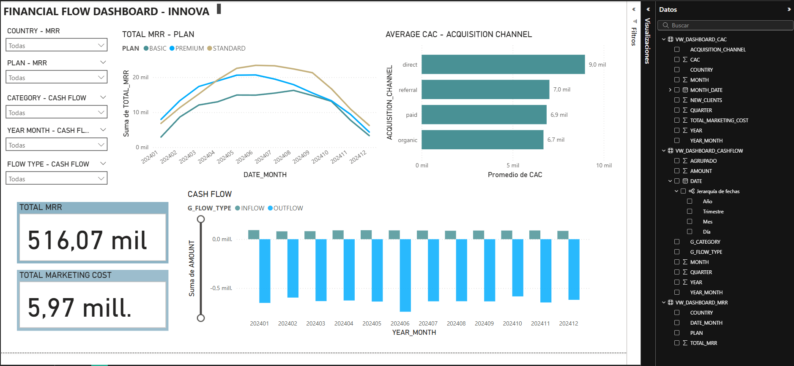

---

# 📊Data Warehouse: El Backend de la Inteligencia SaaS

Este proyecto implementa un Pipeline de Datos integral. La solución transforma datos transaccionales crudos en una arquitectura de **Data Warehouse moderna**, utilizando una arquitectura de medallas (Medallion Architecture), un proceso ELT y un modelo dimensional con la metodología de Ralph Kimball para un Star Schema (Modelo en Estrella)  para potenciar la toma de decisiones estratégicas.

---

##  1. Arquitectura de la Solución

Se ha seleccionado una arquitectura basada en **DuckDB** por su alto rendimiento en procesamiento analítico (OLAP) y su facilidad de orquestación mediante Python.

### Capas de Datos (Medallion Architecture):
1.  **Capa RAW (Bronce):** Ingesta directa de archivos CSV. Los datos se extraen y cargan (EL) con  metadatos para procesos de soporte, trazabilidad y auditoría (`filename`, `load_date`).
2.  **Capa SILVER (Plata):** Limpieza, transformacion y estandarización. Se eliminan duplicados mediante lógica de ventanas, se aplica Slowly Changing Dimensions SCD Tipo 2 para el country SCD Tipo 1 para los demas campos, se formatean y transforman tipos de datos, se crean nuevas columnas de transformacion y se manejan inconsistencias de negocio (ej. fechas de fin de suscripción inválidas).
3.  **Capa GOLD (Oro):** Modelado analítico. Aquí reside el **Modelo en Estrella**, optimizado para consultas de BI y métricas complejas como MRR, CAC y FCF.

---

##  2. Modelo Dimensional Propuesto

Para satisfacer las necesidades del equipo financiero, el modelo Gold se estructura de la siguiente manera:

### Tablas de Hechos (Facts):
-   **`GOLD.FACT_MRR_MONTHLY`**: Grano mensual por suscripción activa. Utiliza lógica recursiva para "llenar los huecos" de meses entre la fecha de inicio y fin, permitiendo ver la evolución del ingreso recurrente MRR.
-   **`GOLD.FACT_CASHFLOW`**: Grano transaccional. Consolida entradas (Pagos) y salidas (Gastos) en una única estructura para calcular el flujo de caja neto.

### Tablas de Dimensiones (Dims):
-   **`GOLD.DIM_DATE`**: Dimensión de tiempo generada con logica recursiva para eficiencia en Power BI.
-   **`SILVER.S_CUSTOMERS`**: Atributos del cliente (segmento, país, canal).
-   **`SILVER.S_EMPLOYEES`**: Datos de nómina y geografía.
-   **`SILVER.S_EXPENSES`**: Gastos 
Nota: Dependiendo de las necesidades en especifico, la dimensiones en que se mencionan de la capa SILVER deberian pasar a la capa GOLD con su respectiva eficiencia en codigo. Guiadas hacia nuevos dashboards interactivos.
---

##  3. Pipeline ELT y Orquestación

El flujo de datos es gobernado por un orquestador central en Python (`main_orchestrator.py`):

1.  **Extracción (`extract.py`):** Lee archivos CSV, normaliza nombres de columnas y registra las tablas en el motor DuckDB. Codigo centralizado en escalabilidad y validacion de archivos.
2.  **Transformación (`silver_transformations.sql`):** Aplica lógica de limpieza y transformacion. Se destaca la creación de la tabla `S_TABLA_ERROR` para identificar registros de suscripciones descartados por errores de lógica de fechas y duplicados.
3.  **Modelado (`gold_metrics.sql`):** Implementa las métricas financieras core y agrupaciones para eficiencia en consultas
4.  **Exposición (`bi_views.sql` y `main_orchestrator`):** Crea vistas optimizadas para consumo externo, el orquestador realiza el pipeline  y exporta archivos **.Parquet**, asegurando un rendimiento superior y menor peso que el formato CSV. Esto para ser leido desde Power Bi

---

##  4. Consultas clave de Negocio (Resultados 2024)

Basado en el modelo implementado , en `Respuestas_prueba.sql`, se han respondido las siguientes métricas clave:

| Pregunta | Resultado |
| :--- | :--- |
| **MRR Total Agosto 2024** | $56,600 |
| **Clientes Nuevos Q1 2024** | 235 |
| **Gastos Marketing H1 2024** | $736,200 |
| **Free Cash Flow (FCF) Diciembre 2024** | -$533,861 |
| **País con mayor ingreso total** | United States ($268,366) |
| **CAC Promedio Anual** | $1,499.35 |

---

## 5. Dashboard Ejecutivo - Innova Finance

El modelo Gold se conecta a un tablero en Power BI, proporcionando visibilidad en tiempo real. El archivo `DASHBOARD BI INNOVA.pbix` contiene el tablero.

 

**Visualizaciones incluidas:**
-   **Evolución del MRR:** Tendencia mensual segmentada por plan.
-   **Análisis de CAC:** Comparativa de eficiencia por canal de adquisición.
-   **Cash Flow:** Visualización de Inflows vs. Outflows.

---

## 6. Escalabilidad y Futuro 

### Escalabilidad a Nuevos Países y Monedas:
-   **Multimoneda:** Para escalar a otras divisas, simplemente se propone añadir una tabla de tasas de cambio diarias `S_EXCHANGE_RATES`, cruzarlas mediante un `JOIN` en la capa SILVER y obtener la transformacion en las tablas silver con las columnas `amount_local` y `amount_usd`, realizando la conversión dinámicamente.


### Automatización y DevOps:
-   **dbt (data build tool):** Para una implementación productiva, propongo migrar las transformaciones SQL a dbt (data build tool) para obtener las siguientes ventajas:
Modelado Incremental (Append): Optimización del pipeline cambiando la materialización de table (overwrite) a incremental. Esto permite procesar solo las nuevas transacciones diarias, reduciendo drásticamente el consumo de cómputo y memoria. Ademas datos mas precisos para posibles SCD tipo 1 guardados en el esquema de RAW, con la carga y compiliacion exacata de cada consideracion de duplicado en el historial.
Gestión de Infraestructura: Configuración de perfiles de conexión para asignar modelos pesados (Capa Gold) a clusters de alta memoria y modelos ligeros a clusters económicos.
Data Quality & Alarms: Implementación de tests de unicidad y consistencia financiera con alertas automáticas ante anomalías en métricas críticas como el MRR.
Seguridad: Aplicación de políticas de encriptación a nivel de columna para datos sensibles de nómina y clientes, asegurando el cumplimiento de normativas de privacidad.

### IA y Machine Learning:
-   **Forecast Financiero:** Utilizar modelos de series temporales (Prophet o ARIMA) sobre la tabla `FACT_MRR_MONTHLY` para predecir ingresos futuros.
-   **Clasificación Inteligente:** Implementar técnicas de Procesamiento de Lenguaje Natural (NLP) para leer descripciones de los proveedores en los archivos de gastos. Esto permitiría clasificar automáticamente un gasto como "Infraestructura" o "Marketing" aunque el nombre del proveedor sea ambiguo o nuevo, reduciendo el error humano y el trabajo manual de limpieza en la capa Silver.


---

## 7. Configuración del Proyecto

### Requisitos Previos:
-   Python 3.8+
-   PIP (Gestor de paquetes)

### Instalación:
1.  Clona el repositorio.
2.  Instala las dependencias necesarias:
    ```bash
    pip install -r requirements.txt
    ```

### Ejecución del Pipeline:
Para ejecutar todo el proceso (desde extracción hasta la generación de archivos para Power BI), corre:
```bash
python main_orchestrator.py
```
*Esto generará el archivo `innova.duckdb` y los archivos `.parquet` en la carpeta `Outputs_parquet/`.*

Para explorar la Base de datos generada `innova.duckdb`, se recomienda utilizar:
* **DBeaver:** Conector nativo de DuckDB disponible.
* **DataGrip:** Ideal para análisis avanzado de SQL.

---

**Autor:** [German Camilo Sambony Ledezma] - Data Engineer 
**Contacto:** [camilosambony@gmail.com/[LinkedIn](https://www.linkedin.com/in/germansambony-dataengineer/)]
